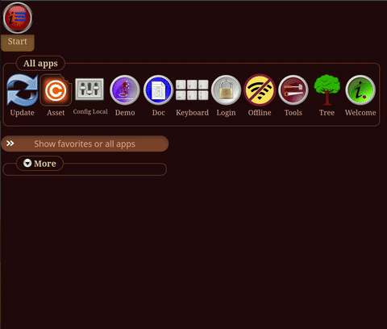
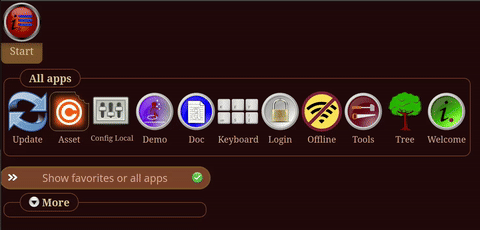
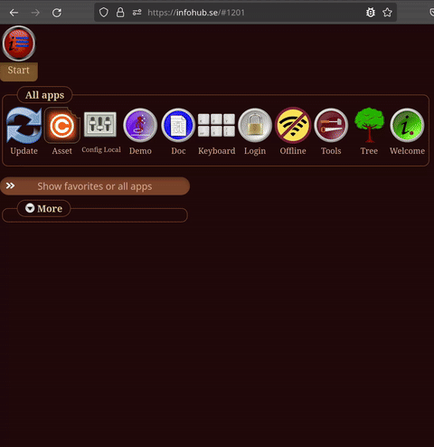

# InfoHub - Your private web operating system


You reach your encrypted data on all your devices and can run the InfoHub applications you like.
InfoHub is not about sharing. InfoHub run on your own or your friends trusted server, on the Internet or in your private network.

After 15 years the core features are still being developed. InfoHub is stable and secure but lacks three things:
* Automatic translations (LibreTranslate will be used) - Working on that now for version 1.3.40
* Automatic sync of your data between client and server (The Three plugin) - Will be version 1.3.50 
* Applications - Will come a lot of those when the Three plugin is finished.

InfoHub send messages between plugins. That makes all your functions pure, and most core functions are also pure.

Client is written in Javascript. Server is written in PHP. The core files are row by row identical between the languages.

| Start your programs from the Workbench                 | Add favorite programs in its own list                        |
|--------------------------------------------------------|--------------------------------------------------------------|
|   |           |
| Switch between favorites and all programs              | Open your favorite app directly                              |
|  |  |

Here are some [screenshots](folder/doc/main/gallery/main_gallery.md). 
You can test [Infohub](https://infohub.se) yourself. There are demo accounts.
You can find [articles](https://github.com/peterlembke/infohub-articles#readme) in Swedish and English.


[](https://www.gnu.org/licenses/gpl-3.0)


# License
License: GNU [GPL-3.0-or-later](LICENSE.md). See license [details](folder/doc/license/license.md).

# Installation

Use the installation script to install a local development environment and configure InfoHub.
```
./install.sh 
```

If you want to do everything manually then there is the [installation](folder/doc/installation/installation.md) instructions.

# Documentation
On GitHub, you find the [documentation](https://github.com/peterlembke/infohub/tree/master/folder/doc).

# Releases
InfoHub have been developed since 2010-01-01 and have some [releases](CHANGELOG.md).
InfoHub is complete. InfoHub Core get new features. Applications for InfoHub will be created once the Tree plugin is finished.

You can follow the releases on [Twitter](https://twitter.com/LembkePeter)

# Backer
You can support my effort with money on [](https://www.paypal.com/paypalme/peterlembke).  
Thank you for your contribution.

# Report a bug, idea, issue
[](code_of_conduct.md)  
Register issues, bugs and ideas on [GitHub](https://github.com/peterlembke/infohub/issues).
Check the existing issues to avoid duplicates. 

# Contribute code
I need to get back on that when I have read up on how this works.  
[How to contribute](https://www.dataschool.io/how-to-contribute-on-github/)

# Contact
* 
* [Github](https://github.com/peterlembke)
* [Blog contact](https://blog.infohub.se/contact/)

Updated 2024-06-03
