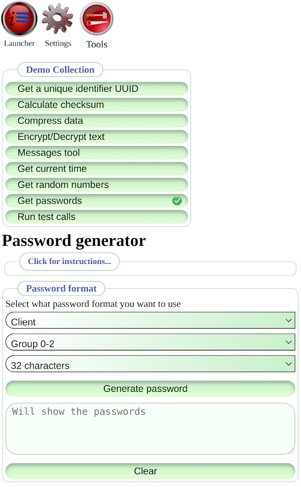
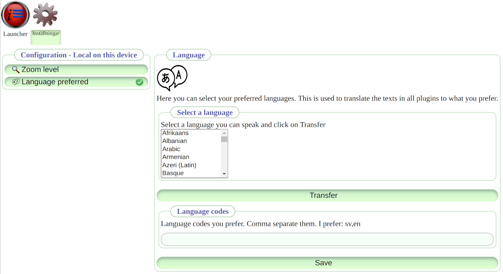
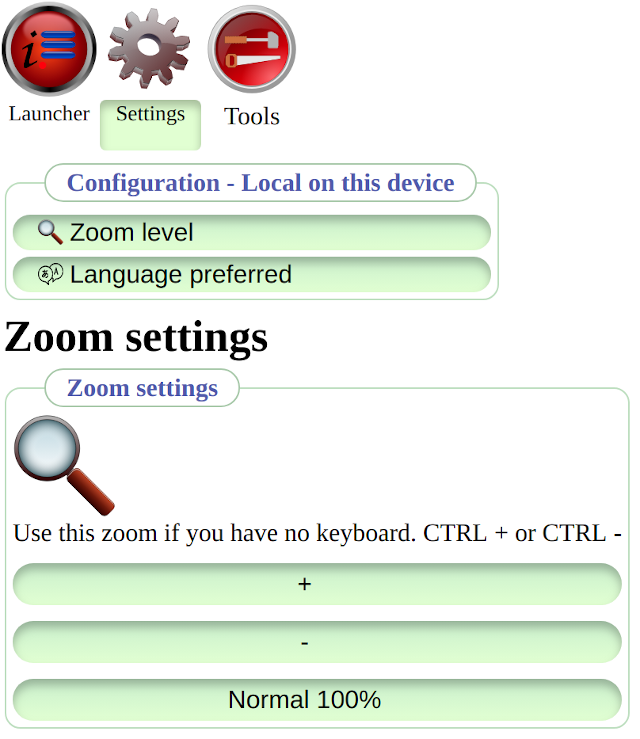

# InfoHub
- See the [home page](https://infohub.se) for more information.

# Your private place on the web
Infohub is not about sharing. InfoHub handle your private data on your own or your friends trusted server on the internet or in your private network.
This is a generic platform where you run your plugins. The long term aim is to create a trustworthy operating system you can use in your web browser.

# License
* License: GNU [GPL-3.0-or-later](LICENSE.md)
* License [details](folder/doc/license/license.md)

The branding "Applies to the Infohub terms" and/or the corresponding logo can only be used on your site if you, the site owner apply to the terms in [TERMS.md](TERMS.md).

# Current status
Infohub is complete. I will improve the core Infohub but focus on applications for Infohub. First application will be the Tree.

See below [Apps for personal data](#Apps for personal data) for more information what you will be able to do in Infohub.

# Releases
Infohub have been developed since 2010-01-01 and have some [releases](CHANGELOG.md). 

# Plugins
You know you can install programs on the computer, or install apps on the phone, or install add-ons in your browser. Regardless of the name we call them it is just software. In Infohub you can install plugins, but it is the same thing. 
 
You can use existing plugins. You can also easily write your own plugins if you have basic knowledge of a programming language where there exist a core. I have written a core for PHP and for Javascript.
A plugin is one single class that always extend the base class, that is it.

# Lead words in building InfoHub 
I refer to these rules every time I am in doubt how to solve something.

**No exceptions**
- Use ONE way to do things, and stick to it.
- For example: ALL traffic go the same way. ALL data are stored in the same way. and so on.

**Make it simple**
- Simple means to write code that everyone can read.
- Simple code often mean fast code. Choose simple over fast but avoid slow code.
- Choose solutions that are simple to understand and simple to implement.
- Let InfoHub stay small, simple and fast. Put new abilities in plugins.

**Self containing**
- A plugin have no dependencies on other plugins. (Learn how dependency free sub calls are done between plugins)
- A plugin can be used outside InfoHub in any other software project without changes.

# What is this repository for?
- The master branch contain Infohub releases. I do not develop in this branch.
- A tag for each release.

# How do I set it up?
Install a LAMP locally on your machine or run a Docker with LAMP.
Clone this git repository. Surf to your web server.  
Read more [here](https://github.com/peterlembke/infohub-articles#readme)

# Contribution guidelines
Not written yet. It will be pull requests here on GitHub.

If you want to support my effort with money then I have a [PayPal.Me link](https://www.paypal.com/paypalme/peterlembke). Thank you for your contribution.

# Who do I talk to?
There are no forum yet at the [home page](https://infohub.se).

# More to read
On GitHub, you find the [documentation](https://github.com/peterlembke/infohub/tree/master/folder/doc) and [articles](https://github.com/peterlembke/infohub-articles#readme). 

# Traditional web page
You can run the [workbench](https://infohub.se) or start a plugin as a [standalone](https://demo.infohub.se) page.
That means you can create a traditional web page with Infohub.

# Plans for InfoHub 
also see the [CHANGELOG](CHANGELOG.md) for future plans.

## Done parts
* PHP Core
* PHP Storage
* JS Core
* JS Storage
* Translation system - Spanish, English, Swedish
* Assets system
* Documentation system
* JS rendering system inclusive forms
* JS and PHP logging system
* doc.infohub.se - Runs only the documentation plugin. To show that Infohub can be used as a "normal" web page with any content. You do not need to run Workbench.
* JS Offline - Service worker must update cached files - v 1.2.2
* JS Encryption - Single point encryption - v 1.2.3
* JS Cron - A cron you can subscribe to and get a message when it is time. Can be used for saving data at intervals
* PHP Login & Sessions - Login without revealing password
* JS Login & Sessions - Sessions without cookies
* Introduction articles written in English and Swedish.

## Planned parts I am working on
The Tree plugin. The Login procedure. Running any plugin standalone.

## Future plans
InfoHub is your private place on the internet.
To keep your data safe I will be very restrictive of what features Infohub will get.

In the Infohub domain I will implement
* Planned parts I am working on
* Developer tools
* System features
* Accessibility

I have more domain names. They are not part of the Infohub core and are optional.

In the teamfakta domain I will implement
 * Apps for personal data
 * Enrich personal data from outer sources
 * Enrich personal data from calculations
 * Static data that could enrich your personal data

### Developer tools
Things I will implement.
* PHP Plugin test system - Tests will write them self. Will record live data. 
* JS Plugin test system - Tests will write them self. Will record live data.
* JS Developer config - Enable the four restart buttons on the keyboard, view developer plugins, enable logging.

### System features
Things I will implement.
* JS Web workers - So I can encapsulate plugins from reaching each other
* JS Darkhold - Split a task on many web workers. Collect the web worker answers and return one answer.   
* PHP Cron - A cron you can subscribe to and get a message when it is time. Can be used to take backups, clean out expired data
* JS Cron - A cron you can subscribe to and get a message when it is time. Can be used to save data to the server. Get updated data from the server in the background.
* Subscribe to messages - An intercept system for messages so plugins can be extended, modified, substituted. 

### Accessibility
Things I will implement.
* Audio - Audio feedback when loading, saving, end of line and so on. This is a big and important area. Implementing in steps.
* Image - Set how image colours should be transformed to suite your eyes.
  This is now implemented in the colour schema.
* Font - Select the font type you prefer from the browser built in fonts.
* Keyboard navigation - tab index, short-cut keys.

Everyone benefits from better visibility on the web pages. 

### Apps for personal data
Things I will implement.
* Tree - The main organizer for your pieces of data. Here all personal data is stored.

Each of the plugins below is a graphical interface that help you to register and view a specific kind of data.
Things I might implement.
* Health - Your health data. Resting pulse, Blood sugar, blood pressure, weight, measures.
* Training - Your workouts like running, gym, spinning, walking etc.
* Thing - Register your larger things: What it is, when you bought it, serial number, warranty and so on.
* Usage - Register when you use a thing. Could be running shoes, moped, bicycle etc.  
* Calendar - Your future and past todo and what you have done. Find data by date.
* Planning - Your projects. You can set up tasks in projects here. Date when things must be done and when they were done.
* Diary - How was your day. Write the text version of your day and use links to your data.
* Media (images/video/audio) - Your catalog with media and its metadata.
* Contact - The contact information to your friends.
* Budget - Calculate your income and expected expenses in this plugin.
* Expense - Register your purchases to keep track where the money goes.   
* Review - Write your reviews of films, books, records, TV series, games, subscriptions, magazines. 
    Then you can see what movies you have seen and when you saw them.
* Story - Pick data from the other plugins and put together a story that look like a newspaper.
* Place - You can register places you have visited and get a map with dots.
* Event - Register events you want to participate in or have participated in. 

### Enrich personal data from outer sources
Data that the server fetch from 3rd party API or from other Infohub servers and can enrich your personal data.
* Weather - Get the weather and temperature for a place and date.
* Map - Get a snapshot from an open street map
* Event - Get event details
* Holiday - Get data for your calendar
* Name of the day - Get data for your calendar
* Sun/moon cycles - So you know when it is dark and how dark

### Enrich personal data from calculations
* Pace - calculator for your workouts or running events
* Graph - Use data from the other plugins and select a graph to view the data.

### Static data that could enrich your personal data
Things I might implement.
* Country flags and country information. 
    Can be used in your texts.
* Colour names and their colour codes. 
    You can write the name of a colour, and it is then possible to see that colour.

## Bad ideas
Things I will not implement.
I have a long list with bad ideas and why they are bad for InfoHub.
Some examples:
* Interface to Twitter, Facebook, Google Calendar, LinkedIn, Garmin, WordPress, Bank data.
    Bad because Infohub is not about sharing. And Infohub is also not a reader for external data.
    Use the services as they were intended to be used.
* Image editor, Video editor, Audio editor.
    Bad because InfoHub is about information. There are excellent tools outside InfoHub that can handle this.
* Tracking behaviour, Tracking position, even calculating any GPS data is bad. IP positioning.
    All kind of tracking is against what Infohub is about. Privacy.
* Send/receive sms/email/Slack/chat
    Bad because Infohub is not about sharing. Use appropriate software for that instead.
* Scraping data from sites
    That practice is not fair. Bad idea.
* Read RSS files, Wikipedia, Web search like DuckduckGo, Bing, Google etc. 
    Use the services as they were intended to be used. Infohub is not a viewer for external data.
* Smart home with Telldus live, and view webcam streams.
    Bad because there are already appropriate software for that. Also, not so good to have log in to these services stored on the Infohub server.

## Other Cores - ["There is another system"](https://en.wikipedia.org/wiki/Colossus:_The_Forbin_Project)
The Infohub Core can be implemented in any language. 
The PHP/JS cores are template implementations how the systems work. If you implement an Infohub core in another language you might have to modify the systems to suite that platform. The important thing is that as a developer you can recognize the inner workings of the system when you jump between implementations.

The core concepts are:

* Level 1
    * Communication between nodes in the Infohub format
    * Kick out tests
* Level 2
    * Message queues system
    * Plugin system
* Level 3 - Pick what you need
    * Login and sessions
    * Storage system
    * Rendering system for Graphical User Interface

You could have a static software that implement Level 1 so other Infohub cores can communicate with it.

You could implement Level 2 so other developers more easily can get started with the core and write plugins.

You could implement what you need from Level 3. An internet service core, like the PHP core is, could need the storage system and log in & sessions but do not need a GUI.

A Python Core that aim to be a desktop solution might implement all levels.

A Node Core that aim to be a service only need Level 1 and perhaps Level 2. 

Updated 2021-01-09

# Images
The launcher is where you start plugins.

## Welcome plugin.

## Tools desktop

## Tools on a smaller screen.

# Settings for language

# Settings for zoom

## Documentation

That is just some examples of what Infohub can do. 

# License
This documentation is copyright (C) 2016 Peter Lembke.  
Permission is granted to copy, distribute and/or modify this document under the terms of the GNU Free Documentation License, Version 1.3 or any later version published by the Free Software Foundation; with no Invariant Sections, no Front-Cover Texts, and no Back-Cover Texts.  
You should have received a copy of the GNU Free Documentation License along with this documentation. If not, see [https://www.gnu.org/licenses/](https://www.gnu.org/licenses/).  SPDX-License-Identifier: GFDL-1.3-or-later  
