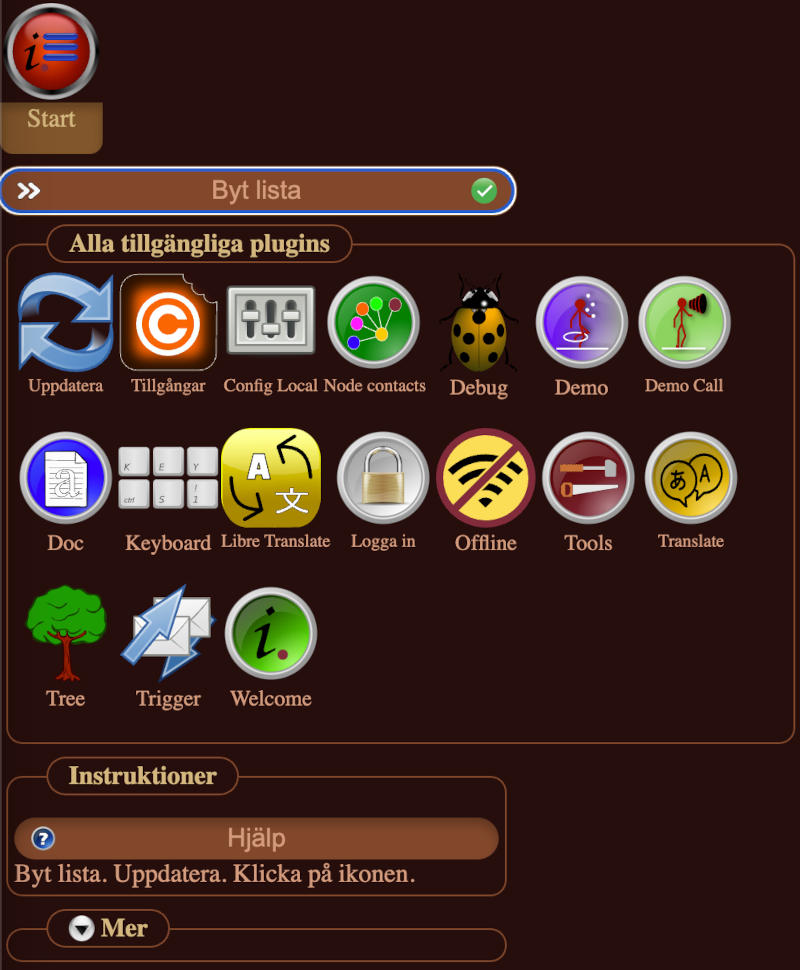
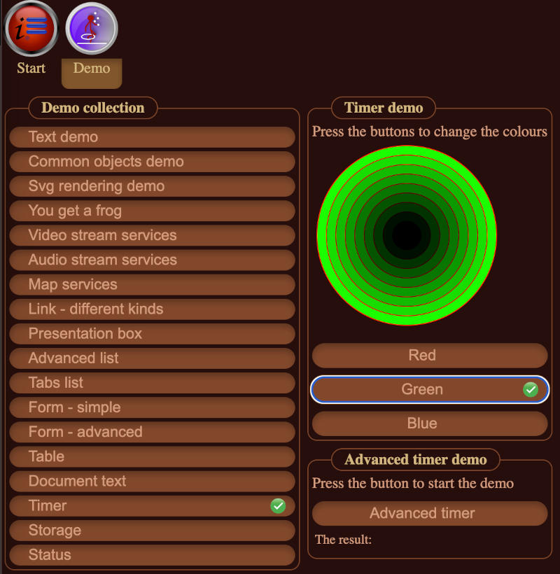
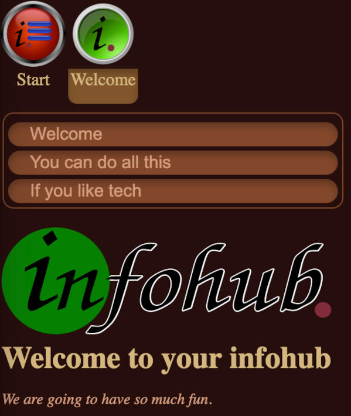

# InfoHub gallery

Screenshots from InfoHub. You can test InfoHub for yourself at the [home page](https://infohub.se).

# Workbench
The workbench is where you start and manage your applications.

# Demo
The demo application show what InfoHub can do.

# Welcome
The Welcome application give you inspiration what InfoHub can do for you.
Here you also get technical information how InfoHub works.

## License
This documentation is copyright (C) 2016 Peter Lembke.
 Permission is granted to copy, distribute and/or modify this document under the terms of the GNU Free Documentation License, Version 1.3 or any later version published by the Free Software Foundation; with no Invariant Sections, no Front-Cover Texts, and no Back-Cover Texts.
You should have received a copy of the GNU Free Documentation License along with this documentation. If not, see [https://www.gnu.org/licenses/](https://www.gnu.org/licenses/).

Created 2021-12-26 by Peter Lembke  
Updated 2021-12-26 by Peter Lembke
