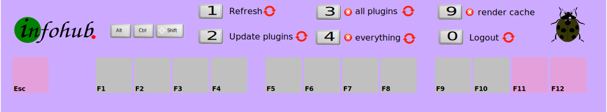

# InfoHub Debug

Handles the four refresh commands you can use to clear/update the local cache in your browser.

# Introduction

If you refresh the page as you normally do wit CTRL + R or F5 then you could get caught in the ban system and get an
error with more ban time.

The refresh methods used in InfoHub Debug wait for the ban time to end and then refresh the page.

InfoHub is designed with speed in mind. The browser locally caches plugins, assets, settings. Normally all these are
automatically updated when the cache gets old. If they are not updated, or you want to speed things up then you need to
handle the cache yourself.



# Browser cache lifetime

The browser cache is handled by [infohub_cache](plugin,infohub_cache).

The cache is updated when it gets old. See `infohub_cache.json`:

```
{
    "client": {
        "client_cache_lifetime": 604740
    },
    "server": {}
}
```   

If you need to change anything in this file then copy the file to `folder/config/infohub_cache.json` and do your
changes. Your file will be used instead of the original file.

# GUI buttons

The graphical user interface show four buttons:

- Reload page. `shift alt ctrl 1`
- Clean out old plugins marked by the server. reload page. `shift alt ctrl 2`
- Clean out all local plugins, reload page. `shift alt ctrl 3`
- Clean out all local data, reload page. `shift alt ctrl 4`

The #3 is useful when you want to keep your configuration but clear out all plugins.

The #4 is useful when the error won't go away.

The #2 was intended to be faster than #3, but they are roughly at the same speed, so I mostly use #3.

# Key listeners

InfoHub Debug register four keyboard key combinations and have listeners for them.

You can see the keyboard subscriptions in [infohub_keyboard](plugin,infohub_keyboard).

## Mac and Linux/Windows

On Linux/Windows you use SHIFT + ALT + CTRL.

On Mac you use the same combination SHIFT + ALT + CTRL.

# Touch devices

Touch devices are computers that have no keyboard.

## Refresh the page

When you refresh the page a couple of times then the first refresh will update the local plugins in the background. The
second refresh will use the local plugins.

## Use InfoHub Debug GUI

The gui gives you the four buttons on screen. But this is only useful if you can start the plugin. That is not always
the case.

## Use Launcher refresh

The refresh option #3 is also available as an on-screen button in the Workbench Launcher.

# License

This documentation is copyright (C) 2020 Peter Lembke.    
Permission is granted to copy, distribute and/or modify this document under the terms of the GNU Free Documentation
License, Version 1.3 or any later version published by the Free Software Foundation; with no Invariant Sections, no
Front-Cover Texts, and no Back-Cover Texts.    
You should have received a copy of the GNU Free Documentation License along with this documentation. If not,
see [https://www.gnu.org/licenses/](https://www.gnu.org/licenses/). SPDX-License-Identifier: GFDL-1.3-or-later

Since 2020-01-02 by Peter Lembke    
Updated 2020-01-02 by Peter Lembke  
