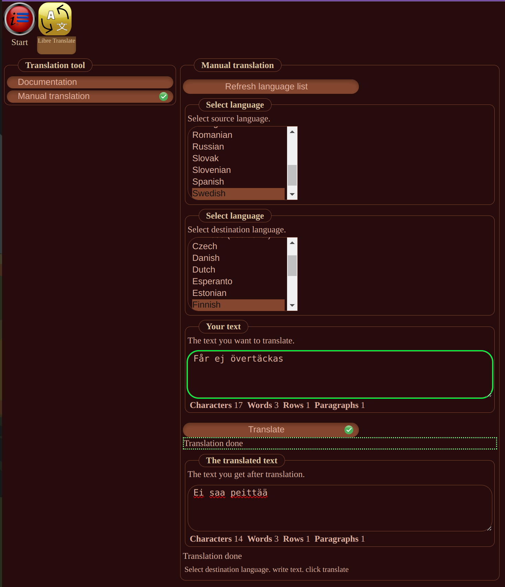

# InfoHub LibreTranslate Manual

You can manually translate text with LibreTranslate. This is a graphical user interface that will help you with the translation process.

## GUI

## Usage

1. Select the language you want to translate from.
2. Select the language you want to translate to.
3. Enter the text you want to translate.
4. Click the "Translate" button.
5. The translated text will appear in the "Translated text" field.
6. If you want to translate more text, repeat steps 3-5.

## License

This documentation is copyright (C) 2024 Peter Lembke.  
Permission is granted to copy, distribute and/or modify this document under the terms of the GNU Free Documentation
License, Version 1.3 or any later version published by the Free Software Foundation; with no Invariant Sections, no
Front-Cover Links, and no Back-Cover Links.  
You should have received a copy of the GNU Free Documentation License along with this documentation. If not,
see [https://www.gnu.org/licenses/](https://www.gnu.org/licenses/).

## footer

Since 2021-08-15 by Peter Lembke  
Updated 2024-06-09 by Peter Lembke
