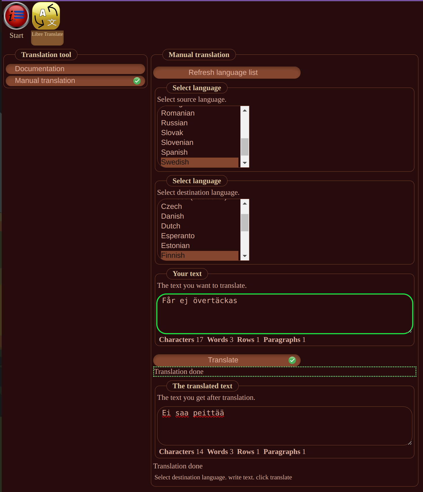

# InfoHub LibreTranslate Plugin

Pick the plugins and the languages you want to translate to.
Translation files will be created.

## GUI

## Usage

1. Multi select the plugins you want to translate.
2. Multi select the languages you want to translate to.
3. Click the "Translate" button.

## License

This documentation is copyright (C) 2024 Peter Lembke.  
Permission is granted to copy, distribute and/or modify this document under the terms of the GNU Free Documentation
License, Version 1.3 or any later version published by the Free Software Foundation; with no Invariant Sections, no
Front-Cover Links, and no Back-Cover Links.  
You should have received a copy of the GNU Free Documentation License along with this documentation. If not,
see [https://www.gnu.org/licenses/](https://www.gnu.org/licenses/).

## footer

Since 2021-08-15 by Peter Lembke  
Updated 2024-11-10 by Peter Lembke
