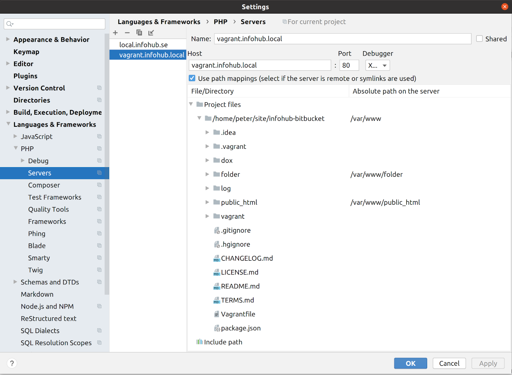

# Vagrant development environment

Vagrant starts VirtualBox. VirtualBox is a software computer that runs an operating system.
Here we run Ubuntu 20.04 + the web server Apache 2 + the database MySQL 5.7 + the language PHP 7.4

When you have installed VirtualBox + Vagrant and run vagrant up then you can surf to
```
http://vagrant.infohub.local/phpinfo.php
```
If that works then you can continue with reading: [install infohub](install-infohub.md).

## Install VirtualBox
Virtual box is the virtualization engine that will run Ubuntu.
Get the installation file [here](https://www.virtualbox.org/wiki/Downloads). 

## Install Vagrant
Vagrant can be installed on Linux, macOS and Windows.
You have the official installations [here](https://www.vagrantup.com/downloads).

You also need to install the vagrant guest tools. 
```
vagrant plugin install vagrant-vbguest
```

## local hosts file
You need to change your hosts file.
On Linux and macOS you start up a terminal and write:
```
sudo nano /etc/hosts
```
You need to add
```
192.168.33.12	vagrant.infohub.local
```
CTRL + O, CTRL + X

## use vagrant
In the terminal you change folder to where you have downloaded the Infohub source.

* vagrant up - sets up the vagrant box / starts the vagrant box
* vagrant provision - run this if you have changed something in the Vagrantfile or vagrant/vagrant.sh
* vagrant reload - run if you need to restart the box
* vagrant halt - when you want to close down the box
* vagrant ssh - Go into the box. Exit with... exit
* vagrant box update - Downloads the latest version of the box

All CLI commands are found [here](https://www.vagrantup.com/docs/cli).  

## Time issues
Many users have noted that the clock in the guest operating system can differ quite much compared to the host operating system.
Infohub is sensitive with the timing. The transfer between the client and the server are signed with time.

Read more about the issue [here](https://github.com/laravel/homestead/issues/799).

The solution I use can be seen in `vagrant/vagrant.sh`
If you experience issues with the transfer then this can be the problem. Run the solution manually in the box or restart the box with:
```
vagrant provision
```

## xdebug
This Vagrant set up has an active xdebug installation.
You need a xDebug plugin in your browser to activate xdebug. 

If you run PHP Storm you need to click "Start listening for debug connections". 

You also need to map the source paths at menu Files >> Settings >> Languages & Frameworks >> PHP >> Servers

 

## The guest system
Right now we run Ubuntu 20.04 LTS (ubuntu/focal64) and that version contains PHP 7.4

See all Ubuntu boxes [here](https://app.vagrantup.com/ubuntu).

## Database
Vagrant install the database MySQL 5.7. Infohub will use the database server without any more configuration.

If you want to see what is in the database in the vagrant box then you can connect with a database viewer. My favourite is [dbeaver](https://dbeaver.io/).

To connect with the database we will SSH into the vagrant box and then in the box connect to the local database in there.

First we check where your vagrant private_key are.
```
vagrant ssh-config
```
Start vagrant and dbeaver. Add a new connection in dbeaver.

Connection settings:
* server host = 127.0.0.1
* port = 3306 (default for MySQL)
* database = local_infohub_se
* user = root
* password = topsecret 

A little down on the left side you find menu "Network" and then tab "SSH Tunnel".
* use ssh tunnel = true
* host = 127.0.0.1
* port = 2222 (default for vagrant)
* username = vagrant (default for vagrant)
* Authentication method = Public key
* Private key = The full path you got from vagrant ssh-config
* Passphrase = vagrant (default for vagrant)
* save password = true

Press button "Test connection". If it works press "OK". 

You can now see what Infohub does in the database.

# License
This documentation is copyright (C) 2020 Peter Lembke.  
Permission is granted to copy, distribute and/or modify this document under the terms of the GNU Free Documentation License, Version 1.3 or any later version published by the Free Software Foundation; with no Invariant Sections, no Front-Cover Texts, and no Back-Cover Texts.  
You should have received a copy of the GNU Free Documentation License along with this documentation. If not, see [https://www.gnu.org/licenses/](https://www.gnu.org/licenses/).  SPDX-License-Identifier: GFDL-1.3-or-later  

Created 2020-07-22 by Peter Lembke  
Changed 2020-07-23 by Peter Lembke  
